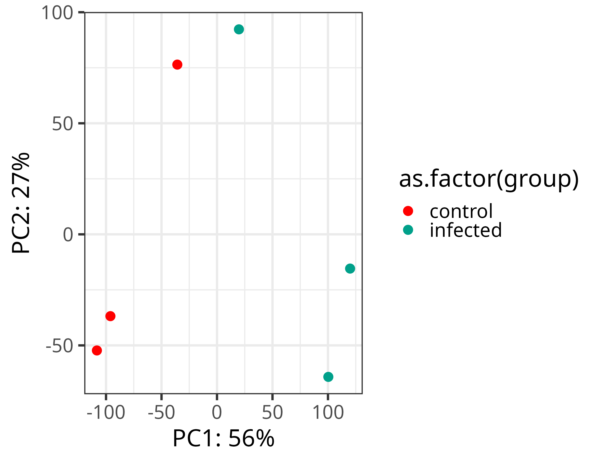
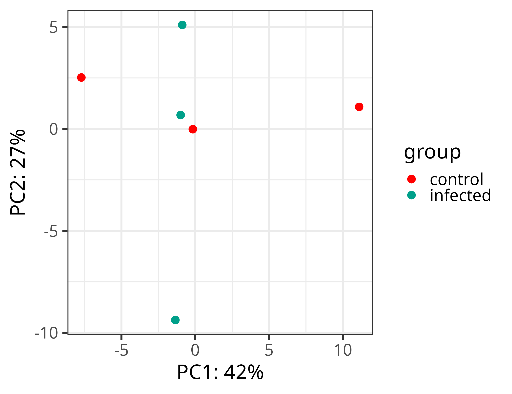
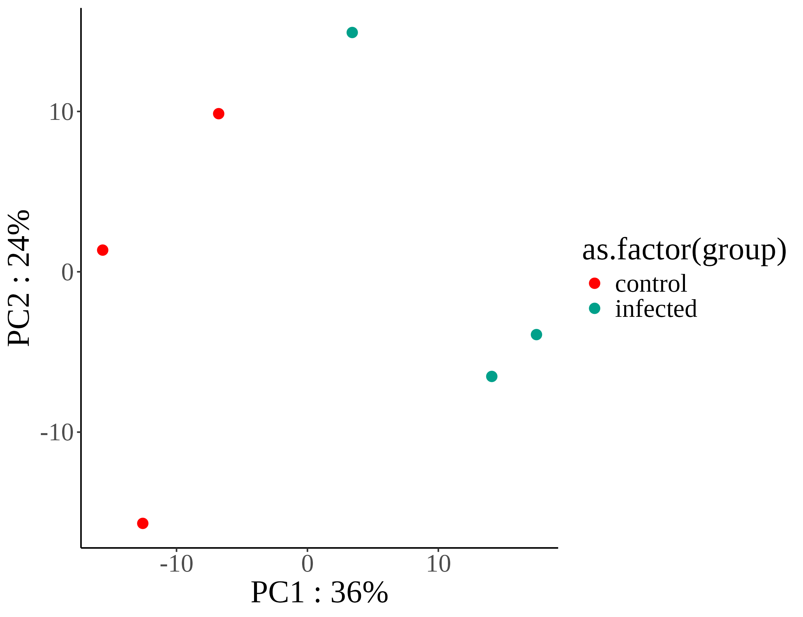
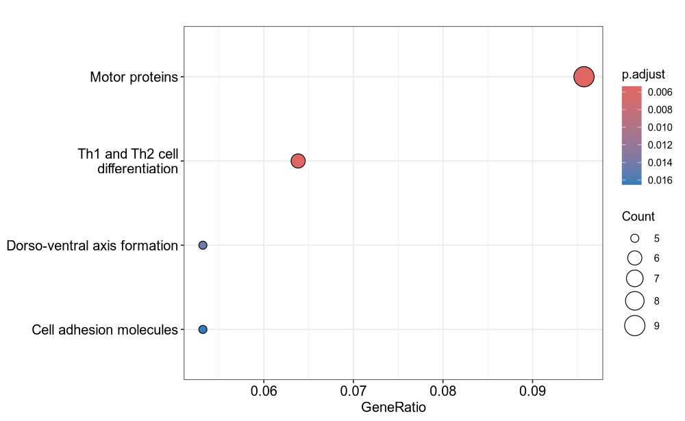
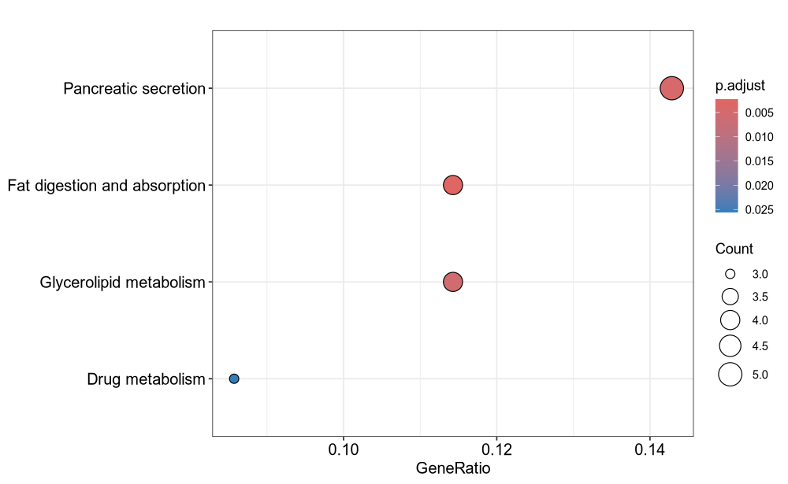
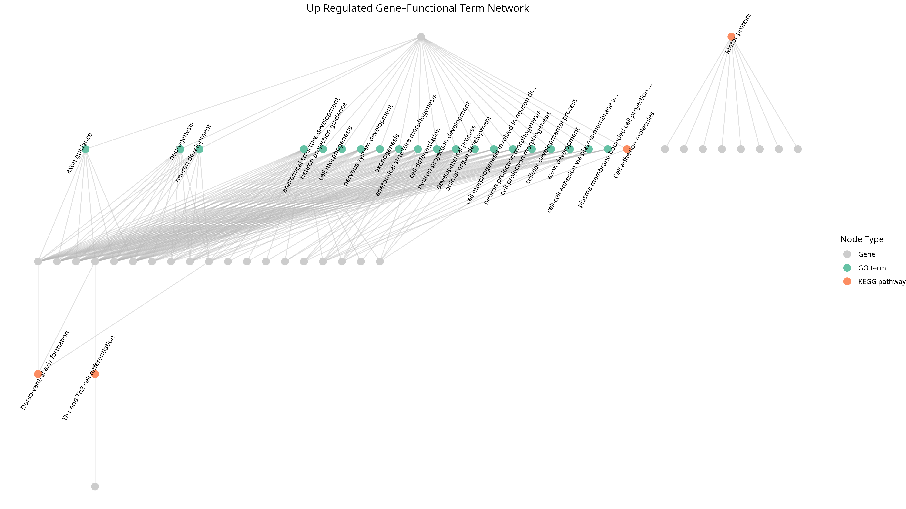
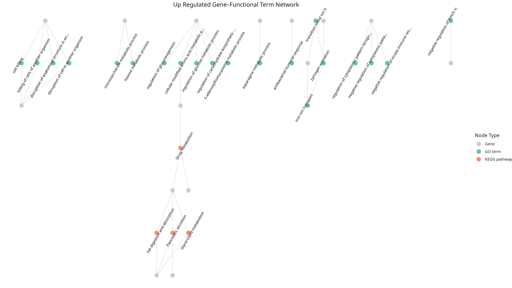

# Multiomics analysis of *Diatrea saccharalis*

## Overview

This repository accompanies the study of the molecular mechanisms of interaction of *Diatrea* infected with *Fusarium* including several techniques, RNAseq, Metabolomics and Microbiome.

ALL FILES IN /home/diegoj/rnaseq_diatraea/

---

## Repository Structure

```
RNAseq
Microbiome
Metabolomics
Integration

```

## RNAseq Workflow Description

| sample         | fastq_1                                                                                      | fastq_2                                                                                      | strandedness | group     |
|----------------|----------------------------------------------------------------------------------------------|----------------------------------------------------------------------------------------------|---------------|-----------|
| control_rep1   | /home/diegoj/rnaseq_diatraea/raw_reads/interaction1_rep1_R1_paired.fq.gz                    | /home/diegoj/rnaseq_diatraea/raw_reads/interaction1_rep1_R2_paired.fq.gz                    | auto          | control   |
| control_rep2   | /home/diegoj/rnaseq_diatraea/raw_reads/interaction1_rep2_R1_paired.fq.gz                    | /home/diegoj/rnaseq_diatraea/raw_reads/interaction1_rep2_R2_paired.fq.gz                    | auto          | control   |
| control_rep3   | /home/diegoj/rnaseq_diatraea/raw_reads/interaction1_rep3_R1_paired.fq.gz                    | /home/diegoj/rnaseq_diatraea/raw_reads/interaction1_rep3_R2_paired.fq.gz                    | auto          | control   |
| infected_rep1  | /home/diegoj/rnaseq_diatraea/raw_reads/interaction2_rep1_R1_paired.fq.gz                    | /home/diegoj/rnaseq_diatraea/raw_reads/interaction2_rep1_R2_paired.fq.gz                    | auto          | infected  |
| infected_rep2  | /home/diegoj/rnaseq_diatraea/raw_reads/interaction2_rep2_R1_paired.fq.gz                    | /home/diegoj/rnaseq_diatraea/raw_reads/interaction2_rep2_R2_paired.fq.gz                    | auto          | infected  |
| infected_rep3  | /home/diegoj/rnaseq_diatraea/raw_reads/interaction2_rep3_R1_paired.fq.gz                    | /home/diegoj/rnaseq_diatraea/raw_reads/interaction2_rep3_R2_paired.fq.gz                    | auto          | infected  |


### 1. **References**

- `GeneBank`: GCA_918026875.4, *Diatraea saccharalis*
- `Genome Assembly`: reference_genomes/diatraea_saccharalis/GCA_918026875.4_PGI_DIATSA_v4_genomic.fna.gz
- `Proteins`: reference_genomes/diatraea_saccharalis/GCA_918026875.4_PGI_DIATSA_v4_protein.faa.gz
- `GTF`: reference_genomes/diatraea_saccharalis/genomic.gtf

### 2. **Protein Annotation**

We used `emapper-2.1.3` from `EggNOG v5.0` to get KEGG orthology annotations for the proteins of the genome based on orthology relationships. 
- Code: `eggnog/run_eggnog.sh`
- Results: `eggnog/annotation/proteins.emapper.emapper.annotations`
- Virtual envirorment: `eggnog/eggnog.yml`

We used `PANNZER2` (http://ekhidna2.biocenter.helsinki.fi/sanspanz/) to assing GO terms to the proteins.

- Code: `panzzer/SANSPANZ.3/runsanspanz.py`
- Results: `panzzer/annot_01/formated_go.txt`
- Virtual envirorment: NO

### 3. **RNAseq processing**

We used a `Nextflow v25.04.7` pipeline `rnaseq (v3.12.0)` from nf-core (https://nf-co.re/rnaseq/3.12.0) to preprocces, align and quantify RNAseq data

We used the default method from `rnaseq (v3.12.0)` which uses `STAR` aligner and `Salmon` to quantify transcript abundance.

Full report of preprocess and aligment can be found in 
[Download full report (html)](rnaseq_diatraea/rnaseq/run_paired_samples/multiqc/star_salmon/multiqc_report.html)*(right-click and save as to view)*


### 4. **Exploratory Analysis**

- Principal component analysis: We load the quantification data produced by Salmon into DESEQ2 (Love et al., 2014) and used the transformed counts matrix variance stabilizing transformation (vst) which accounts for the dependance between abundance and variance in RNAseq data.

[View the full report (PDF)](rnaseq/run_paired_samples/star_salmon/deseq2_qc/deseq2.plots.pdf)

- Remove batch effects: We used RUVseq package (v1.40.0) to try to remove the unwanted variation in replicate 1 in both conditions (control and infected), we tried 
RUVs, RUGg and RUVr methods (see: https://bioconductor.org/packages/release/bioc/manuals/RUVSeq/man/RUVSeq.pdf)

code: rnaseq/run_paired_samples/star_salmon/deseq2_qc/ruv.r

    - RUVs (We selected this correction for downstream analysis)


    - RUVg


    - RUVr



### 5. **Differential Expression Analysis (DEA)**

We conducted a differential expression analysis (DEA) between the two sample groups (control vs. infected). We used `lfcThreshold = 1` and `altHypothesis = "greaterAbs"` to identify transcripts that were differentially expressed at least twofold above or below the background expression level. We refer to upregulated genes as those more highly expressed in the infected condition than in the control, and downregulated genes as those more highly expressed in the control than in the infected condition.

we found 82 genes down-regulated and 147 upregulated (p-value < 0.05). We corrected for multiple p-values using Benjamini–Hochberg (BH) procedure.

- code: rnaseq/run_paired_samples/star_salmon/deseq2_qc/ruv.r
- results: /home/diegoj/rnaseq_diatraea/rnaseq/run_paired_samples/star_salmon/deseq2_qc

### 6. **Functional Enrichment Analysis**

To get insights about the function and the processes that are represented by the sets of up-regulated and down-regulated genes we carried out over representation analysis (ORA) for gene ontology terms (GO) and KEGG pathways.

- GO: We used topGO R package (v2.58.0), p-value < 0.05 and corrected for multiple testing using BH procedure

    - Up: [View overrepresented GO terms in up-regulated genes (PDF)](rnaseq/run_paired_samples/star_salmon/deseq2_qc/GO_up.pdf)

    - Down: [View overrepresented GO terms in down-regulated genes (PDF)](rnaseq/run_paired_samples/star_salmon/deseq2_qc/GO_down.pdf)

- KEGG: We used enrichKEGG function from Cluster profiler R package (v4.14.6) to get KEGG enriched categories in each gene set

    - Up: 

    - Down: 


### 7. **Transcription Factor Annotation**

We invstigated if some of the DEGs were predicted as Transcription Factors using http://www.insecttfdb.com/ which uses  AnimalTFDB (Animal Transcription Factor Database) version 4.0, to search PFAM transcription factors protein domains using Hmmer v3.3 in our querys.

We found eight up-regulated differential expressed gene predicted as TF 

| Query ID       | Domain Name | Accession    | E-value   | Score | Bias |
|----------------|--------------|--------------|-----------|-------|------|
| CAG9783855.1   | THR-like     | -            | 5.1e-45   | 145.6 | 0.3  |
| CAG9786977.1   | BTB          | PF00651.37   | 2.1e-29   | 94.1  | 0.1  |
| CAG9787444.1   | zf-C2H2      | PF00096.32   | 1.2e-31   | 99.7  | 120.1|
| CAG9791224.1   | Homeobox     | PF00046.35   | 3e-08     | 25.6  | 0.4  |
| CAG9794522.1   | NDT80_PhoG   | PF05224.17   | 4.5e-33   | 107.1 | 2.3  |
| CAG9795420.1   | zf-C2H2      | PF00096.32   | 2.5e-25   | 79.8  | 57.6 |
| CAH0748350.1   | THR-like     | -            | 5.5e-30   | 96.5  | 0.2  |
| CAH0748970.1   | bHLH         | PF00010.31   | 5.2e-05   | 15.2  | 0.4  |

 
Remarkably one gene DIATSA_LOCUS4889 -> CAG9783855.1 (protein) was detected with GO and KEGG annotations 

| Gene ID           | Term                                 | Type | Database |
|--------------------|--------------------------------------|------|-----------|
| DIATSA_LOCUS4889   | neurogenesis                         | gene | GO        |
| DIATSA_LOCUS4889   | neuron development                   | gene | GO        |
| DIATSA_LOCUS4889   | anatomical structure development     | gene | GO        |
| DIATSA_LOCUS4889   | nervous system development           | gene | GO        |
| DIATSA_LOCUS4889   | cell differentiation                 | gene | GO        |
| DIATSA_LOCUS4889   | developmental process                | gene | GO        |
| DIATSA_LOCUS4889   | animal organ development             | gene | GO        |
| DIATSA_LOCUS4889   | cellular developmental process       | gene | GO        |
| DIATSA_LOCUS4889   | Dorso-ventral axis formation         | gene | KEGG      |


### 8. **GO-KEGG Interaction Network**

- Up: 

- Down: 

### 9. **Important Files**

| **Process Step** | **Description** | **File Path** |
|------------------|-----------------|----------------|
| **Quality Control** | MultiQC report | `rnaseq/run_paired_samples/multiqc/star_salmon/multiqc_report.html` |
| **Quantification (Salmon)** | TPM counts | `rnaseq/run_paired_samples/star_salmon/salmon.merged.gene_tpm.tsv` |
| | RAW counts | `rnaseq/run_paired_samples/star_salmon/salmon.merged.transcript_counts.tsv` |
| **Differential Expression (DESeq2)** | Up-regulated genes | `rnaseq/run_paired_samples/star_salmon/deseq2_qc/genes_up.txt` |
| | Down-regulated genes | `rnaseq/run_paired_samples/star_salmon/deseq2_qc/genes_down.txt` |
| | Main R script | `rnaseq/run_paired_samples/star_salmon/deseq2_qc/ruv.r` |
| **Functional Enrichment (GO & KEGG)** | GO up results | `rnaseq/run_paired_samples/star_salmon/deseq2_qc/GO_up.csv` |
| | GO down results | `rnaseq/run_paired_samples/star_salmon/deseq2_qc/GO_down.csv` |
| | GO–KEGG interaction network (up-regulated) | `rnaseq/run_paired_samples/star_salmon/deseq2_qc/up_network_edges_with_class.tsv` |
| | GO–KEGG interaction network (down-regulated) | `rnaseq/run_paired_samples/star_salmon/deseq2_qc/down_network_edges_with_class.tsv` |
| **Functional Annotation** | EggNOG results | `eggnog/annotation/proteins.emapper.emapper.annotations` |
| | PANNZER results | `panzzer/annot_01/formated_go.txt` |

