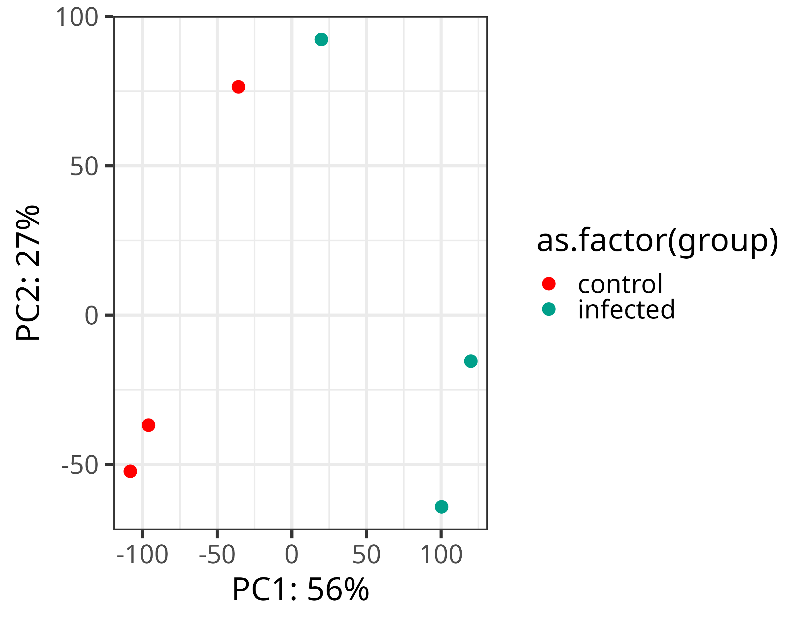
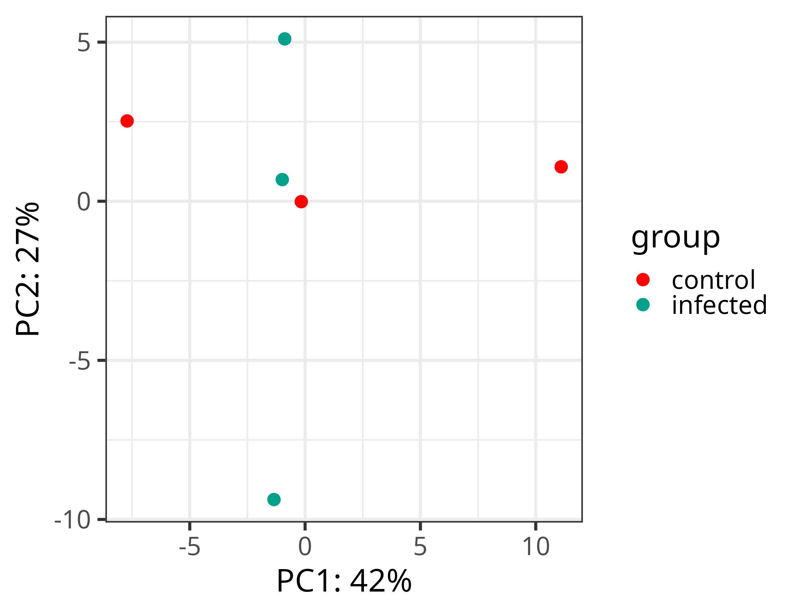
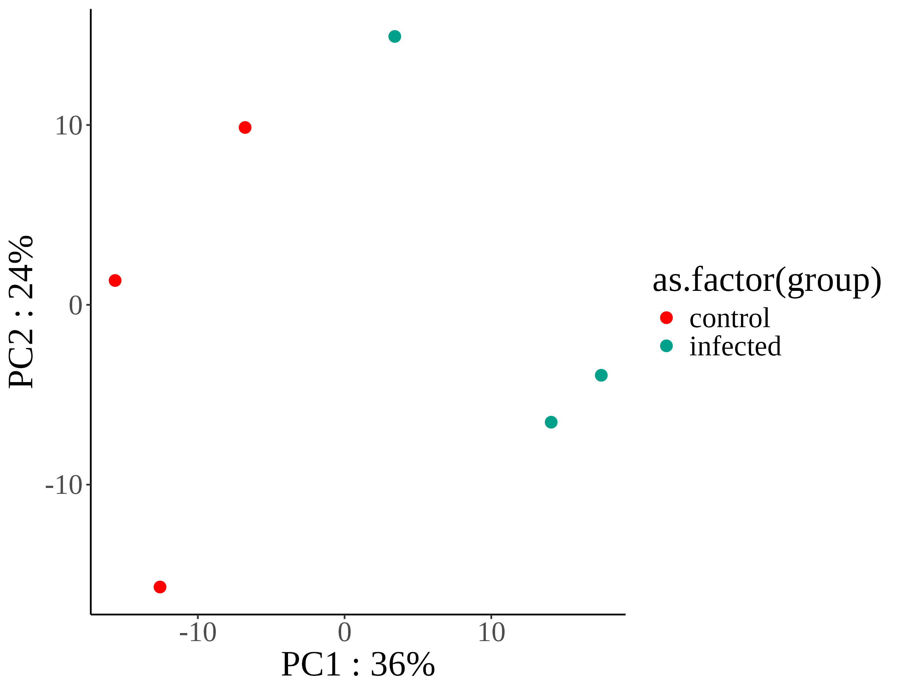
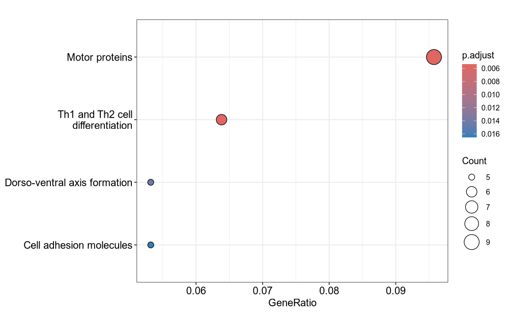
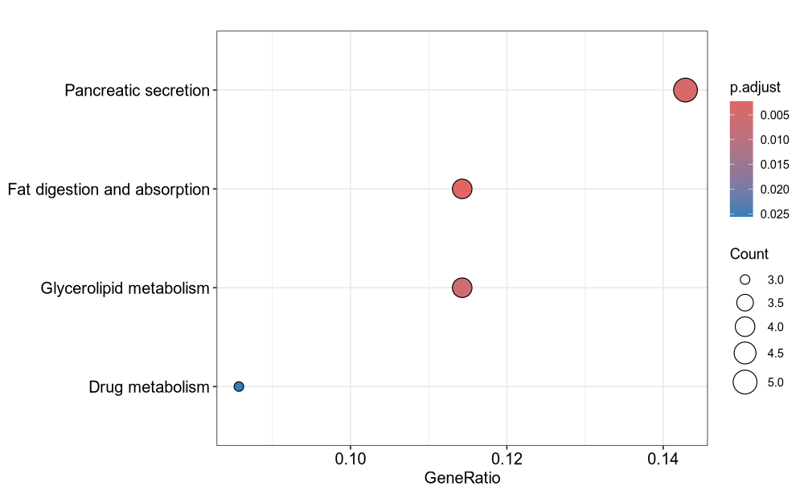
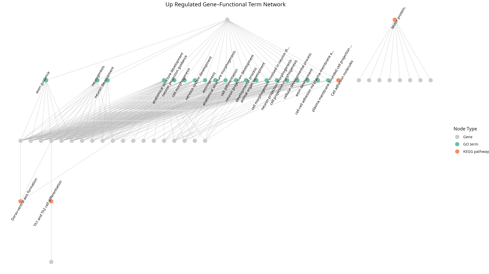
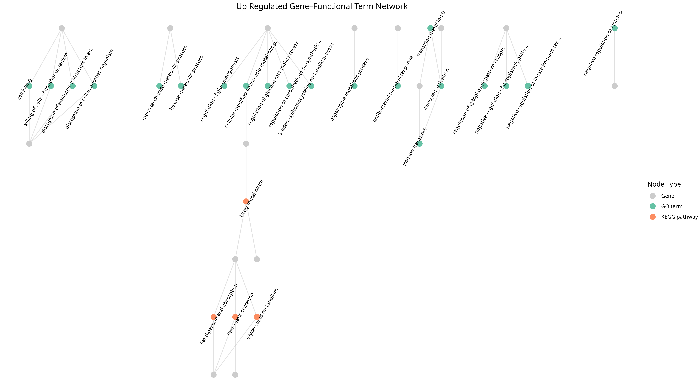

# Multiomics analysis of *Diatrea saccharalis*

## Overview

This repository accompanies the study of the molecular mechanisms of interaction of *Diatrea* infected with *Fusarium* including several techniques, RNAseq, Metabolomics and Microbiome.

ALL FILES IN /home/diegoj/rnaseq_diatraea/

---

## Table of Contents
- [RNAseq Workflow](rnaseq-workflow-description)
- [RNAseq Sugarcane](rnaseq-sugarcane)
- [Dependencies](#dependencies)
- [Script Descriptions](#script-descriptions)
- [Usage Instructions](#usage-instructions)
- [Data Files and Terminology](#data-files-and-terminology)


## Repository Structure

```
RNAseq
Microbiome
Metabolomics
Integration

```

## RNAseq Workflow Description

| sample         | fastq_1                                                                                      | fastq_2                                                                                      | strandedness | group     |
|----------------|----------------------------------------------------------------------------------------------|----------------------------------------------------------------------------------------------|---------------|-----------|
| control_rep1   | /home/diegoj/rnaseq_diatraea/raw_reads/interaction1_rep1_R1_paired.fq.gz                    | /home/diegoj/rnaseq_diatraea/raw_reads/interaction1_rep1_R2_paired.fq.gz                    | auto          | control   |
| control_rep2   | /home/diegoj/rnaseq_diatraea/raw_reads/interaction1_rep2_R1_paired.fq.gz                    | /home/diegoj/rnaseq_diatraea/raw_reads/interaction1_rep2_R2_paired.fq.gz                    | auto          | control   |
| control_rep3   | /home/diegoj/rnaseq_diatraea/raw_reads/interaction1_rep3_R1_paired.fq.gz                    | /home/diegoj/rnaseq_diatraea/raw_reads/interaction1_rep3_R2_paired.fq.gz                    | auto          | control   |
| infected_rep1  | /home/diegoj/rnaseq_diatraea/raw_reads/interaction2_rep1_R1_paired.fq.gz                    | /home/diegoj/rnaseq_diatraea/raw_reads/interaction2_rep1_R2_paired.fq.gz                    | auto          | infected  |
| infected_rep2  | /home/diegoj/rnaseq_diatraea/raw_reads/interaction2_rep2_R1_paired.fq.gz                    | /home/diegoj/rnaseq_diatraea/raw_reads/interaction2_rep2_R2_paired.fq.gz                    | auto          | infected  |
| infected_rep3  | /home/diegoj/rnaseq_diatraea/raw_reads/interaction2_rep3_R1_paired.fq.gz                    | /home/diegoj/rnaseq_diatraea/raw_reads/interaction2_rep3_R2_paired.fq.gz                    | auto          | infected  |


### 1. **References**

- `GeneBank`: GCA_918026875.4, *Diatraea saccharalis*
- `Genome Assembly`: reference_genomes/diatraea_saccharalis/GCA_918026875.4_PGI_DIATSA_v4_genomic.fna.gz
- `Proteins`: reference_genomes/diatraea_saccharalis/GCA_918026875.4_PGI_DIATSA_v4_protein.faa.gz
- `GTF`: reference_genomes/diatraea_saccharalis/genomic.gtf

### 2. **Protein Annotation**

We used `emapper-2.1.3` from `EggNOG v5.0` to get KEGG orthology annotations for the proteins of the genome based on orthology relationships. 
- Code: `eggnog/run_eggnog.sh`
- Results: `eggnog/annotation/proteins.emapper.emapper.annotations`
- Virtual envirorment: `eggnog/eggnog.yml`

We used `PANNZER2` (http://ekhidna2.biocenter.helsinki.fi/sanspanz/) to assing GO terms to the proteins.

- Code: `panzzer/SANSPANZ.3/runsanspanz.py`
- Results: `panzzer/annot_01/formated_go.txt`
- Virtual envirorment: NO

### 3. **RNAseq processing**

We used a `Nextflow v25.04.7` pipeline `rnaseq (v3.12.0)` from nf-core (https://nf-co.re/rnaseq/3.12.0) to preprocces, align and quantify RNAseq data

We used the default method from `rnaseq (v3.12.0)` which uses `STAR` aligner and `Salmon` to quantify transcript abundance.

Full report of preprocess and aligment can be found in 
[Download full report (html)](rnaseq_diatraea/rnaseq/run_paired_samples/multiqc/star_salmon/multiqc_report.html)*(right-click and save as to view)*


### 4. **Exploratory Analysis**

- Principal component analysis: We load the quantification data produced by Salmon into DESEQ2 (Love et al., 2014) and used the transformed counts matrix variance stabilizing transformation (vst) which accounts for the dependance between abundance and variance in RNAseq data.

[View the full report (PDF)](rnaseq/run_paired_samples/star_salmon/deseq2_qc/deseq2.plots.pdf)

- Remove batch effects: We used RUVseq package (v1.40.0) to try to remove the unwanted variation in replicate 1 in both conditions (control and infected), we tried 
RUVs, RUGg and RUVr methods (see: https://bioconductor.org/packages/release/bioc/manuals/RUVSeq/man/RUVSeq.pdf)

code: rnaseq/run_paired_samples/star_salmon/deseq2_qc/ruv.r

    - RUVs (We selected this correction for downstream analysis)


    - RUVg


    - RUVr



### 5. **Differential Expression Analysis (DEA)**

We conducted a differential expression analysis (DEA) using DESEeq2 R package between the two sample groups (control vs. infected). We used `lfcThreshold = 1` and `altHypothesis = "greaterAbs"` to identify transcripts that were differentially expressed at least twofold above or below the background expression level. We refer to upregulated genes as those more highly expressed in the control condition than in the infected, and downregulated genes as those more highly expressed in the infected than in the control condition.

we found 82 genes down-regulated and 147 upregulated (p-value < 0.05). We corrected for multiple p-values using Benjamini–Hochberg (BH) procedure.

- code: rnaseq/run_paired_samples/star_salmon/deseq2_qc/ruv.r
- results: /home/diegoj/rnaseq_diatraea/rnaseq/run_paired_samples/star_salmon/deseq2_qc

### 6. **Functional Enrichment Analysis**

To get insights about the function and the processes that are represented by the sets of up-regulated and down-regulated genes we carried out over representation analysis (ORA) for gene ontology terms (GO) and KEGG pathways.

- GO: We used topGO R package (v2.58.0), p-value < 0.05 and corrected for multiple testing using BH procedure

    - Up: [View overrepresented GO terms in up-regulated genes (PDF)](rnaseq/run_paired_samples/star_salmon/deseq2_qc/GO_up.pdf)

    - Down: [View overrepresented GO terms in down-regulated genes (PDF)](rnaseq/run_paired_samples/star_salmon/deseq2_qc/GO_down.pdf)

- KEGG: We used enrichKEGG function from Cluster profiler R package (v4.14.6) to get KEGG enriched categories in each gene set

    - Up: 

    - Down: 


### 7. **Transcription Factor Annotation**

We invstigated if some of the DEGs were predicted as Transcription Factors using http://www.insecttfdb.com/ which uses  AnimalTFDB (Animal Transcription Factor Database) version 4.0, to search PFAM transcription factors protein domains using Hmmer v3.3 in our querys.

We found eight up-regulated differential expressed gene predicted as TF 

| Query ID       | Domain Name | Accession    | E-value   | Score | Bias |
|----------------|--------------|--------------|-----------|-------|------|
| CAG9783855.1   | THR-like     | -            | 5.1e-45   | 145.6 | 0.3  |
| CAG9786977.1   | BTB          | PF00651.37   | 2.1e-29   | 94.1  | 0.1  |
| CAG9787444.1   | zf-C2H2      | PF00096.32   | 1.2e-31   | 99.7  | 120.1|
| CAG9791224.1   | Homeobox     | PF00046.35   | 3e-08     | 25.6  | 0.4  |
| CAG9794522.1   | NDT80_PhoG   | PF05224.17   | 4.5e-33   | 107.1 | 2.3  |
| CAG9795420.1   | zf-C2H2      | PF00096.32   | 2.5e-25   | 79.8  | 57.6 |
| CAH0748350.1   | THR-like     | -            | 5.5e-30   | 96.5  | 0.2  |
| CAH0748970.1   | bHLH         | PF00010.31   | 5.2e-05   | 15.2  | 0.4  |

 
Remarkably one gene DIATSA_LOCUS4889 -> CAG9783855.1 (protein) was detected with GO and KEGG annotations 

| Gene ID           | Term                                 | Type | Database |
|--------------------|--------------------------------------|------|-----------|
| DIATSA_LOCUS4889   | neurogenesis                         | gene | GO        |
| DIATSA_LOCUS4889   | neuron development                   | gene | GO        |
| DIATSA_LOCUS4889   | anatomical structure development     | gene | GO        |
| DIATSA_LOCUS4889   | nervous system development           | gene | GO        |
| DIATSA_LOCUS4889   | cell differentiation                 | gene | GO        |
| DIATSA_LOCUS4889   | developmental process                | gene | GO        |
| DIATSA_LOCUS4889   | animal organ development             | gene | GO        |
| DIATSA_LOCUS4889   | cellular developmental process       | gene | GO        |
| DIATSA_LOCUS4889   | Dorso-ventral axis formation         | gene | KEGG      |


### 8. **GO-KEGG Interaction Network**

- Up: 

- Down: 

### 9. **Important Files**

| **Process Step** | **Description** | **File Path** |
|------------------|-----------------|----------------|
| **Quality Control** | MultiQC report | `rnaseq/run_paired_samples/multiqc/star_salmon/multiqc_report.html` |
| **Quantification (Salmon)** | TPM counts | `rnaseq/run_paired_samples/star_salmon/salmon.merged.gene_tpm.tsv` |
| | RAW counts | `rnaseq/run_paired_samples/star_salmon/salmon.merged.transcript_counts.tsv` |
| **Differential Expression (DESeq2)** | Up-regulated genes | `rnaseq/run_paired_samples/star_salmon/deseq2_qc/genes_up.txt` |
| | Down-regulated genes | `rnaseq/run_paired_samples/star_salmon/deseq2_qc/genes_down.txt` |
| | Main R script | `rnaseq/run_paired_samples/star_salmon/deseq2_qc/ruv.r` |
| **Functional Enrichment (GO & KEGG)** | GO up results | `rnaseq/run_paired_samples/star_salmon/deseq2_qc/GO_up.csv` |
| | GO down results | `rnaseq/run_paired_samples/star_salmon/deseq2_qc/GO_down.csv` |
| | GO–KEGG interaction network (up-regulated) | `rnaseq/run_paired_samples/star_salmon/deseq2_qc/up_network_edges_with_class.tsv` |
| | GO–KEGG interaction network (down-regulated) | `rnaseq/run_paired_samples/star_salmon/deseq2_qc/down_network_edges_with_class.tsv` |
| **Functional Annotation** | EggNOG results | `eggnog/annotation/proteins.emapper.emapper.annotations` |
| | PANNZER results | `panzzer/annot_01/formated_go.txt` |


## RNAseq Sugarcane

| sample | fastq_1 | fastq_2 | strandedness | Tissue | Time_Point | Treatment | Replicate | Group |
|:-------|:---------|:---------|:--------------|:--------|:-------------|:------------|:------------|:------------------------------|
| N31 | /home/diego/RNAseq/Sugarcane_RNAseq_Interaction_Sugarcane_Diatraea_Fusarium/raw_data/N31_120h_T2R1_1.fq.gz | /home/diego/RNAseq/Sugarcane_RNAseq_Interaction_Sugarcane_Diatraea_Fusarium/raw_data/N31_120h_T2R1_2.fq.gz | auto | Stem | 120h | Diatrea | 1 | Stem_120h_Diatrea |
| N32 | /home/diego/RNAseq/Sugarcane_RNAseq_Interaction_Sugarcane_Diatraea_Fusarium/raw_data/N32_120h_T2R2_1.fq.gz | /home/diego/RNAseq/Sugarcane_RNAseq_Interaction_Sugarcane_Diatraea_Fusarium/raw_data/N32_120h_T2R2_2.fq.gz | auto | Stem | 120h | Diatrea | 2 | Stem_120h_Diatrea |
| N33 | /home/diego/RNAseq/Sugarcane_RNAseq_Interaction_Sugarcane_Diatraea_Fusarium/raw_data/N33_120h_T2R3_1.fq.gz | /home/diego/RNAseq/Sugarcane_RNAseq_Interaction_Sugarcane_Diatraea_Fusarium/raw_data/N33_120h_T2R3_2.fq.gz | auto | Stem | 120h | Diatrea | 3 | Stem_120h_Diatrea |
| N37 | /home/diego/RNAseq/Sugarcane_RNAseq_Interaction_Sugarcane_Diatraea_Fusarium/raw_data/N37_120h_T4R1_1.fq.gz | /home/diego/RNAseq/Sugarcane_RNAseq_Interaction_Sugarcane_Diatraea_Fusarium/raw_data/N37_120h_T4R1_2.fq.gz | auto | Stem | 120h | Diatrea+Fusarium | 1 | Stem_120h_Diatrea+Fusarium |
| N38 | /home/diego/RNAseq/Sugarcane_RNAseq_Interaction_Sugarcane_Diatraea_Fusarium/raw_data/N38_120h_T4R2_1.fq.gz | /home/diego/RNAseq/Sugarcane_RNAseq_Interaction_Sugarcane_Diatraea_Fusarium/raw_data/N38_120h_T4R2_2.fq.gz | auto | Stem | 120h | Diatrea+Fusarium | 2 | Stem_120h_Diatrea+Fusarium |
| N39 | /home/diego/RNAseq/Sugarcane_RNAseq_Interaction_Sugarcane_Diatraea_Fusarium/raw_data/N39_120h_T4R3_1.fq.gz | /home/diego/RNAseq/Sugarcane_RNAseq_Interaction_Sugarcane_Diatraea_Fusarium/raw_data/N39_120h_T4R3_2.fq.gz | auto | Stem | 120h | Diatrea+Fusarium | 3 | Stem_120h_Diatrea+Fusarium |

### 1. **References**

- We used the genome assembly Saccharum officinarum X spontaneum var R570 v2.1 (https://www.ncbi.nlm.nih.gov/datasets/genome/GCA_038087645.1/)
- `Genome Assembly`: /home/diegoj/rnaseq_diatraea/reference_genomes/sugarcane/assembly/SofficinarumxspontaneumR570_771_v2.0.fa.gz
- `Proteins`: /home/diegoj/rnaseq_diatraea/reference_genomes/sugarcane/annotation/SofficinarumxspontaneumR570_771_v2.1.protein.fa
- `GFF`: /home/diegoj/rnaseq_diatraea/reference_genomes/sugarcane/annotation/SofficinarumxspontaneumR570_771_v2.1.gene_exons.gff


### 2. **Protein Annotation**

We used the annotatiovs provided in the GFF annotation file


### 3. **RNAseq processing**

We used a `Nextflow v25.04.7` pipeline `rnaseq (v3.12.0)` from nf-core (https://nf-co.re/rnaseq/3.12.0) to preprocces, align and quantify RNAseq data

We used the default method from `rnaseq (v3.12.0)` which uses `STAR` aligner and `Salmon` to quantify transcript abundance.

Full report of preprocess and aligment can be found in
[Download full report (html)](rnaseq/run_sugarcane_diatrea/multiqc/star_salmon/multiqc_report.html)*(right-click and save as to view)*

### 4. **Exploratory Analysis**

- Principal component analysis: We load the quantification data produced by Salmon into DESEQ2 (Love et al., 2014) and used the transformed counts matrix variance stabilizing transformation (vst) which accounts for the dependance between abundance and variance in RNAseq data.

[View the full report (PDF)](rnaseq/run_sugarcane_diatrea/star_salmon/deseq2_qc/deseq2.plots.pdf)

### 5. **Differential Expression Analysis (DEA)**

We conducted a differential expression analysis (DEA) using DESEeq2 R package between the two sample groups control (tem_120h_Diatrea) vs. infected (tem_120h_Diatrea+Fusarium). We used `lfcThreshold = 1` and `altHypothesis = "greaterAbs"` to identify transcripts that were differentially expressed at least twofold above or below the background expression level. We refer to upregulated genes as those more highly expressed in the control condition than in the infected, and downregulated genes as those more highly expressed in the infected than in the control condition.

we found 98 genes down-regulated and 18 upregulated (p-value < 0.05). We corrected for multiple p-values using Benjamini–Hochberg (BH) procedure.

- code: rnaseq/run_sugarcane_diatrea/star_salmon/deseq2_qc/ruv.r
- results: rnaseq/run_sugarcane_diatrea/star_salmon/deseq2_qc

### 6. **Functional Enrichment Analysis**

To get insights about the function and the processes that are represented by the sets of up-regulated and down-regulated genes we carried out over representation analysis (ORA) for gene ontology terms (GO) and KEGG pathways.

- GO: We used topGO R package (v2.58.0), p-value < 0.05 and corrected for multiple testing using BH procedure
    
    - Up: We only found one overrepresented GO term in up regulated genes: GO:0006508	proteolysis

    - Down: [View overrepresented GO terms in down-regulated genes (PDF)](rnaseq/run_sugarcane_diatrea/star_salmon/deseq2_qc/GO_down.pdf)

- KEGG: We used enrichKEGG function from Cluster profiler R package (v4.14.6) to get KEGG enriched categories in each gene set. We could not detect overrepresented KEGG genes


### 7. **Transcription Factor Annotation**

Transcription associated proteins (TAPs) domains were identified using Hmmer v3.3.2 (Eddy, 2011) against Pfam v34 (El-Gebali et al., 2019). Protein domains were classified into TAPs families following the rules used in PlnTFDB  (Riaño-Pachón et al., 2007; Pérez-Rodríguez et al., 2010).

    Results: rnaseq/run_sugarcane_diatrea/star_salmon/deseq2_qc/only_tf.out


We found one up regulated gene classified as TF, this genes have 3 isforms all classified as MYB-related TF

| Protein ID                         | Family      | Category |
|:--------------------------------|:-------------|:----------|
| SoffiXsponR570.07Dg092200.2.p | MYB-related | TFF |
| SoffiXsponR570.07Dg092200.1.p | MYB-related | TFF |
| SoffiXsponR570.07Dg092200.3.p | MYB-related | TFF |

We found 2 genes down regulated classified as TF (bHLH), each gene has two isoforms.

| Protein ID                         | Family | Category |
|:--------------------------------|:--------|:----------|
| SoffiXsponR570.03Ag094400.1.p | bHLH | TFF |
| SoffiXsponR570.03Ag094400.2.p | bHLH | TFF |
| SoffiXsponR570.01Eg058700.1.p | bHLH | TFF |
| SoffiXsponR570.01Eg058700.2.p | bHLH | TFF |

---

This block contains the R scripts used for the statical data analysis and visualization presented in the associated scientific article. The scripts cover a range of omics and experimental assay data, including transcriptomics, metabolomics, microbiome analysis, qPCR, and growth kinetics.

## Dependencies

The scripts require R (>= 4.0.0) and the following packages. You can install them using the code below:

### CRAN Packages
```R
install.packages(c("tidyverse", "ggplot2", "dplyr", "readxl", "openxlsx", "scales", 
                   "car", "emmeans", "broom", "ggpubr", "rstatix", "reshape2", 
                   "gridExtra", "multcomp", "multcompView", "patchwork", "ggrepel", 
                   "janitor", "FactoMineR", "factoextra", "corrplot", "RColorBrewer", 
                   "Polychrome", "ape", "vegan", "writexl"))
```

### Bioconductor Packages
```R
if (!require("BiocManager", quietly = TRUE))
    install.packages("BiocManager")

BiocManager::install(c("topGO", "phyloseq", "ALDEx2", "ggtree", "ggnewscale"))
```

---

## Script Descriptions

Below is a detailed list of the scripts included in this repository and the corresponding figures they generate.

### 1. Transcriptomics
*   **`transcriptomic_fig5a_S6.R`**: Performs Gene Ontology (GO) enrichment analysis (using `topGO`) for up- and down-regulated genes in Diatraea saccharalis under fungal exposure. It generates both curated and global enrichment plots (dot plots) and exports detailed GO term results.
    *   **Outputs:** Figure 5a, Supplementary Figure S6.

### 2. Metabolomics
*   **`metabolomic_fig4a_S5ab.R`**: Processes metabolomics concentration data from insect oral secretions (OS). Includes data cleaning, log-transformation, statistical testing (t-tests with FDR correction), and generation of individual/compact conditional violin plots, volcano plots, and Principal Component Analysis (PCA) with automated outlier detection and 95% confidence intervals.
    *   **Outputs:** Figure 4a, Supplementary Figures S5a, S5b.

### 3. Microbiome
*   **`microbiome_fig3_S3_S4.R`**: A comprehensive microbiome pipeline for D. saccharalis oral secretion analysis. It handles hierarchical abundance data merging across multiple databases, taxonomic filtering, and `phyloseq` object construction. Performs `ALDEx2` differential expression analysis, alpha/beta diversity metrics (Shannon, Bray-Curtis), PCoA plots, and complex circular phylogenetic tree rings and heatmaps.
    *   **Outputs:** Figure 3, Supplementary Figures S3, S4.

### 4. qPCR Analysis
*   **`qPCR_gradient_fig6gh.R`**: Analyzes qPCR data for the acropetal spatial distribution of F. verticillioides within sugarcane vascular tissues. It employs Two-Way ANOVA, calculates estimated marginal means (95% CI), and performs pairwise comparisons between treatments.
    *   **Outputs:** Figure 6g, 6h.
*   **`qPCR_fig1.R`**: Analyzes time-course qPCR data for fungal DNA quantification in sugarcane stems. Performs assumption testing, Two-Way ANOVA, and post-hoc comparisons using `emmeans` and `bonferroni` adjustments. Generates violin plots with significance annotations.
    *   **Outputs:** Figure 1.

### 5. Growth Kinetics and Biomass
*   **`absorbance_sid_fig4b_S5c.R`**: Analyzes kinetic growth data (OD600) for siderophore-related treatments under defined iron-manipulated conditions. It calculates the Area Under the Curve (AUC), performs ANOVA with Tukey HSD, and generates growth curves and AUC bar charts.
    *   **Outputs:** Figure 4b, Supplementary Figure S5c.
*   **`absorbance_fig2a.R`**: Processes absorbance data over time for *F. verticillioides* and control groups. Generates growth curves and performs statistical tests (ANOVA/Kruskal-Wallis) for each incubation time point.
    *   **Outputs:** Figure 2a.
*   **`GFP quantification_fig2b_S2.R`**: Quantifies fungal biomass using GFP signal intensity across different culture media (MM, MM+sucrose, MM+saliva). Performs One-Way ANOVA/Kruskal-Wallis and generates annotated violin plots.
    *   **Outputs:** Figure 2b, Supplementary Figure S2.
*   **`GFP quantification (sid)_fig4cj_S5d.R`**: Analyzes fungal biomass (GFP) for a specific set of siderophore and iron-manipulation treatments. Includes global ANOVA and post-hoc Tukey HSD analysis, visualized via box and jitter plots.
    *   **Outputs:** Figure 4c, 4j, Supplementary Figure S5d.

---

## Data Files and Terminology

### Data File Mapping
The following table describes the data files available in the `data/` directory and their corresponding analysis scripts:

| Data File | Related Script | Description |
| :--- | :--- | :--- |
| `Absorbancia_fig2a.xlsx` | `absorbance_fig2a.R` | Growth kinetics data (OD600) for Figure 2a. |
| `absorbance_siderophores.xlsx` | `absorbance_sid_fig4b_S5c.R` | Kinetic growth data under iron-manipulated conditions. |
| `GFP_quantification (sid).xlsx` | `GFP quantification (sid)_fig4cj_S5d.R` | Fungal biomass quantification (GFP) for siderophore assays. |
| `GFP quantification_fig2b.xlsx` | `GFP quantification_fig2b_S2.R` | Fungal biomass quantification (GFP) across different media. |
| `source_data_fig1.xlsx` | `qPCR_fig1.R` | Time-course qPCR data for fungal DNA quantification. |
| `qPCR_gradient.xlsx` | `qPCR_gradient_fig6gh.R` | qPCR data for fungal spatial distribution in tissues. |
| `metabolites.xlsx` | `metabolomic_fig4a_S5ab.R` | Metabolomics concentration data from oral secretions. |
| `microbiome.tar.xz` | `microbiome_fig3_S3_S4.R` | Compressed archive containing all microbiome data and results. |
| `all_go_terms.csv`, `down_regulated.csv`, `gene_go_annotations.txt`, `go_selected.csv`, `Supplementary_Data_GO_Enrichment.xlsx`, `up_regulated.csv` | `transcriptomic_fig5a_S6.R` | Transcriptomics data and GO enrichment annotations. |

### Terminology Clarification
The word **"saliva"** is used within some data files and code scripts solely for the purpose of simplifying the code and for internal reference. However, it does not represent the formal definition of the collected material. In our work, we use the material present in the insect's mouth, which is more accurately defined as **oral secretions (OS)**. These secretions are a complex mixture containing saliva, the microbiome, and various enzymes.

---

## Usage Instructions

To run these scripts, follow these steps:

1.  **Clone the Repository:**
    ```bash
    git clone git@github.com:jomare1188/probable-doodle.git
    cd probable-doodle
    ```
2.  **Prepare Data:** Ensure your data files (Excel or CSV) are in the same directory as the scripts or update the file paths within the scripts.
3.  **Insert File Paths:** Each script contains a placeholder like `# Insert file!!!` followed by a reading function (e.g., `read_excel("insert corresponding file")`). You **must** replace `"insert corresponding file"` with the actual path to your data file.
4.  **Execute in R:** Open the scripts in RStudio or run them from the terminal:
    ```R
    source("script_name.R")
    ```
    


