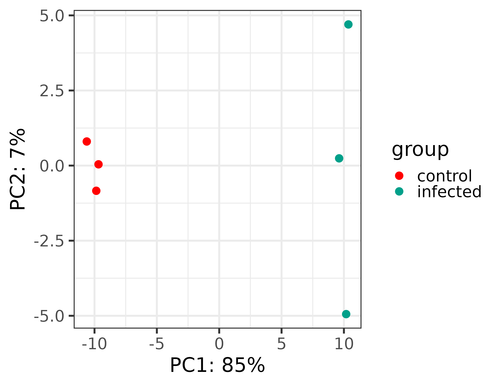
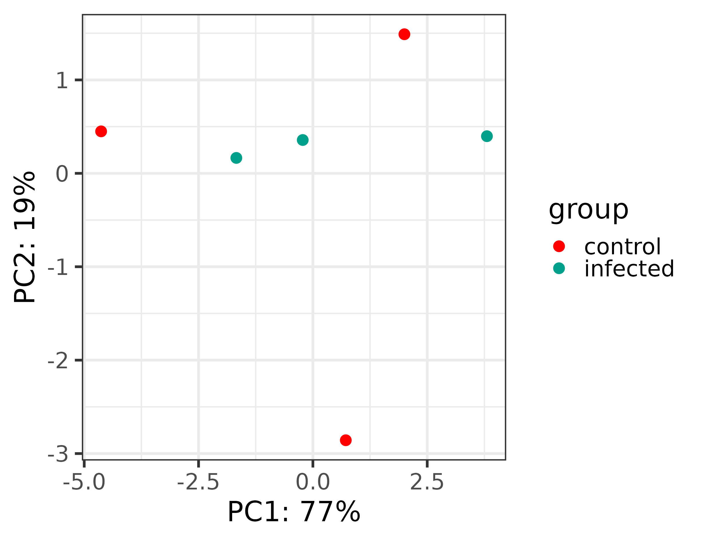
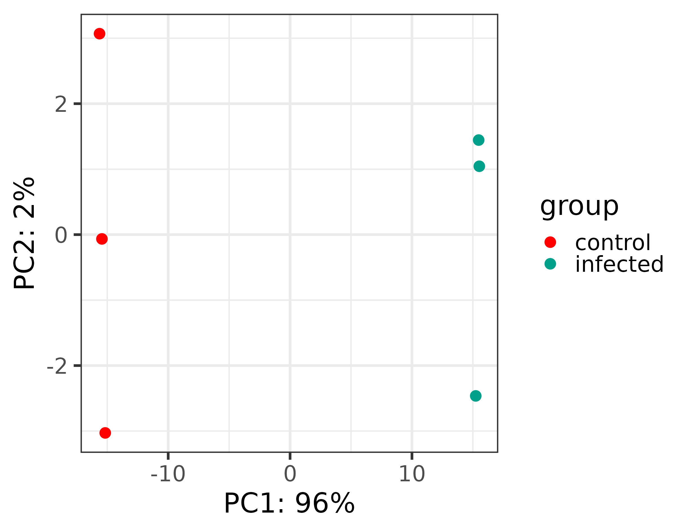
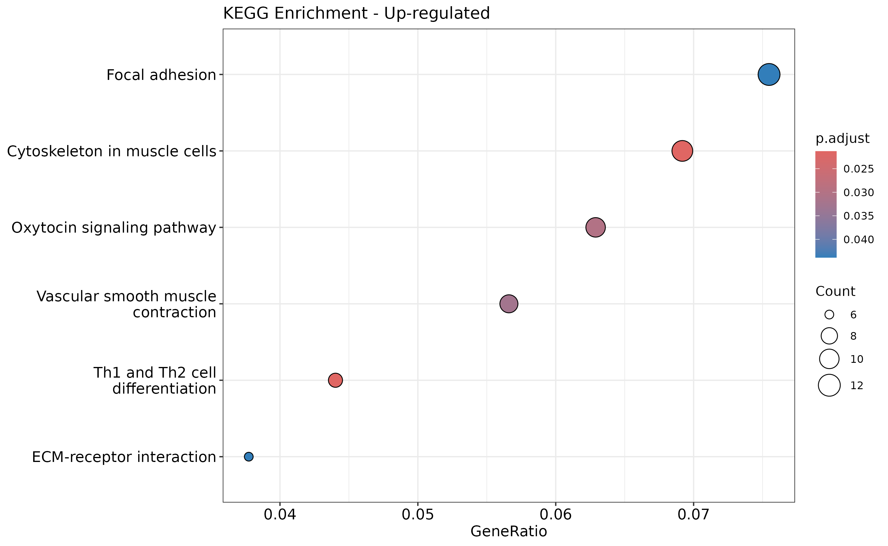
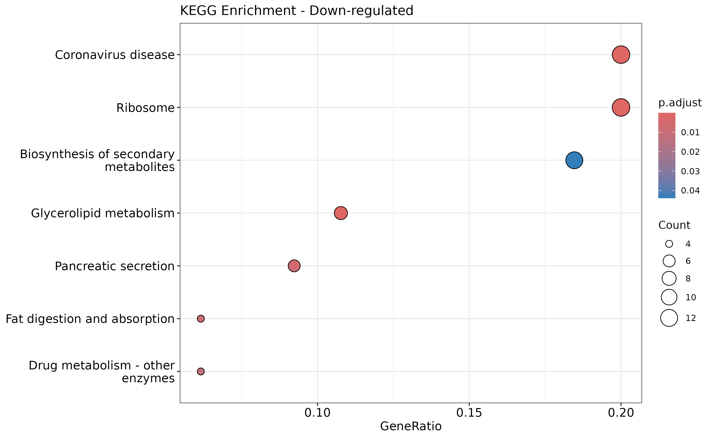
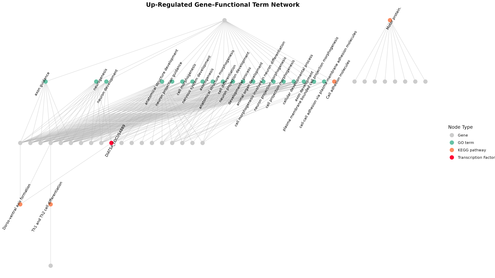
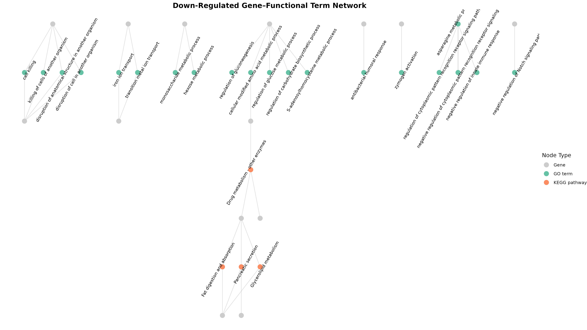

# Multiomics analysis of *Diatrea saccharalis*

## Overview

This repository accompanies the study of the molecular mechanisms of interaction of *Diatrea* infected with *Fusarium* including several techniques, RNAseq, Metabolomics and Microbiome.

ALL FILES IN /home/diegoj/rnaseq_diatraea/

---

## Repository Structure

```
RNAseq
Microbiome
Metabolomics
Integration

```

## RNAseq Workflow Description

| sample         | fastq_1                                                                                      | fastq_2                                                                                      | strandedness | group     |
|----------------|----------------------------------------------------------------------------------------------|----------------------------------------------------------------------------------------------|---------------|-----------|
| control_rep1   | /home/diegoj/rnaseq_diatraea/raw_reads/interaction1_rep1_R1_paired.fq.gz                    | /home/diegoj/rnaseq_diatraea/raw_reads/interaction1_rep1_R2_paired.fq.gz                    | auto          | control   |
| control_rep2   | /home/diegoj/rnaseq_diatraea/raw_reads/interaction1_rep2_R1_paired.fq.gz                    | /home/diegoj/rnaseq_diatraea/raw_reads/interaction1_rep2_R2_paired.fq.gz                    | auto          | control   |
| control_rep3   | /home/diegoj/rnaseq_diatraea/raw_reads/interaction1_rep3_R1_paired.fq.gz                    | /home/diegoj/rnaseq_diatraea/raw_reads/interaction1_rep3_R2_paired.fq.gz                    | auto          | control   |
| infected_rep1  | /home/diegoj/rnaseq_diatraea/raw_reads/interaction2_rep1_R1_paired.fq.gz                    | /home/diegoj/rnaseq_diatraea/raw_reads/interaction2_rep1_R2_paired.fq.gz                    | auto          | infected  |
| infected_rep2  | /home/diegoj/rnaseq_diatraea/raw_reads/interaction2_rep2_R1_paired.fq.gz                    | /home/diegoj/rnaseq_diatraea/raw_reads/interaction2_rep2_R2_paired.fq.gz                    | auto          | infected  |
| infected_rep3  | /home/diegoj/rnaseq_diatraea/raw_reads/interaction2_rep3_R1_paired.fq.gz                    | /home/diegoj/rnaseq_diatraea/raw_reads/interaction2_rep3_R2_paired.fq.gz                    | auto          | infected  |


### 1. **References**

- `GeneBank`: GCA_918026875.4, *Diatraea saccharalis*
- `Genome Assembly`: reference_genomes/diatraea_saccharalis/GCA_918026875.4_PGI_DIATSA_v4_genomic.fna.gz
- `Proteins`: reference_genomes/diatraea_saccharalis/GCA_918026875.4_PGI_DIATSA_v4_protein.faa.gz
- `GTF`: reference_genomes/diatraea_saccharalis/genomic.gtf

### 2. **Protein Annotation**

We used `emapper-2.1.3` from `EggNOG v5.0` to get KEGG orthology annotations for the proteins of the genome based on orthology relationships. 
- Code: `eggnog/run_eggnog.sh`
- Results: `eggnog/annotation/proteins.emapper.emapper.annotations`
- Virtual envirorment: `eggnog/eggnog.yml`

We used `PANNZER2` (http://ekhidna2.biocenter.helsinki.fi/sanspanz/) to assing GO terms to the proteins.

- Code: `panzzer/SANSPANZ.3/runsanspanz.py`
- Results: `panzzer/annot_01/formated_go.txt`
- Virtual envirorment: NO

### 3. **RNAseq processing**

We used a `Nextflow v25.04.7` pipeline `rnaseq (v3.12.0)` from nf-core (https://nf-co.re/rnaseq/3.12.0) to preprocces, align and quantify RNAseq data

We used the default method from `rnaseq (v3.12.0)` which uses `STAR` aligner and `Salmon` to quantify transcript abundance.

Full report of preprocess and aligment can be found in 
[Download full report (html)](rnaseq_diatraea/rnaseq/run_paired_samples/multiqc/star_salmon/multiqc_report.html)*(right-click and save as to view)*

#### Mapping rate test

With the pipeline's default STAR settings only 41–47% of read pairs mapped to the *D. saccharalis* genome. Almost all the rest (53–59%) were reported by STAR as "unmapped: too short", i.e. the alignment covered less than 66% of the read pair, and the mismatch rate of mapped reads was high (~4.2% per base). To check whether the unmapped reads are *Diatraea* or contamination, we took the first 1M read pairs of each sample and remapped them with STAR 2.7.11b (same version, genome and GTF as the pipeline) in three modes:

- **A_default**: nf-core/rnaseq default STAR settings (reproduces the full run within 0.3%)
- **B_relaxed**: `--outFilterScoreMinOverLread 0.3 --outFilterMatchNminOverLread 0.3`
- **C_R1only**: default settings, mate 1 only (single-end)

| Sample | A_default mapped (%) | B_relaxed mapped (%) | C_R1only mapped (%) |
|---------------|------|------|------|
| control_rep1  | 44.3 | 80.4 | 63.4 |
| control_rep2  | 42.0 | 78.9 | 61.7 |
| control_rep3  | 40.9 | 76.2 | 61.5 |
| infected_rep1 | 46.7 | 81.9 | 65.8 |
| infected_rep2 | 44.3 | 80.6 | 64.3 |
| infected_rep3 | 42.8 | 77.0 | 64.0 |
| Mismatch rate per base | ~4.2 | ~5.3 | ~5.9 |

Mapped = uniquely mapped + multi-mapped reads. With relaxed filters 76–82% of the reads map to the genome, with even more mismatches, which points to high sequence divergence between our population and the reference assembly (GCA_918026875.4) rather than contamination. Relaxed filters also allow some spurious partial alignments, so 76–82% should be read as an upper bound.

The pairs still unmapped in B_relaxed (≈18–24%) were classified with `Kraken2 v2.17.1` against the PlusPFP database (bacteria, archaea, viruses, fungi, protozoa, plants, human; no insects):

| Sample | Unclassified | Plants | Fungi | Bacteria |
|---------------|--------|-------|-------|-------|
| control_rep1  | 98.83% | 0.59% | 0.03% | 0.19% |
| control_rep2  | 98.86% | 0.51% | 0.03% | 0.16% |
| control_rep3  | 98.91% | 0.48% | 0.03% | 0.15% |
| infected_rep1 | 97.93% | 0.57% | 0.56% | 0.47% |
| infected_rep2 | 98.10% | 0.52% | 0.48% | 0.40% |
| infected_rep3 | 98.28% | 0.48% | 0.42% | 0.35% |

Fungal reads (mostly *Fusarium*) are enriched only in infected samples, but together with plant and bacterial reads they account for <1% of the data. Contamination therefore does not explain the low default mapping rate.

- code: `rnaseq/run_paired_samples/mapping_test/run_maptest.sh`, `rnaseq/run_paired_samples/mapping_test/run_kraken.sh`
- results: `rnaseq/run_paired_samples/mapping_test/summary.tsv`, `rnaseq/run_paired_samples/mapping_test/kraken/`
- 100 random unclassified reads (for BLAST): `rnaseq/run_paired_samples/mapping_test/unclassified_100_reads.fasta`
- 100 random classified reads, Kraken2 taxon in header (for BLAST): `rnaseq/run_paired_samples/mapping_test/classified_100_reads.fasta`

#### Identification of the unclassified reads

The 100 unclassified reads gave no hits in NCBI web BLAST (blastn, core_nt). They are not technical artifacts (no poly-G, adapters or low-complexity sequence; 57% AT, insect-like). Note that core_nt does not include WGS assemblies, so the *D. saccharalis* genome itself is not searched by web BLAST.

- **Read level:** 10,000 random unclassified reads were searched with `blastn -task blastn` (BLAST+, e-value 1e-5) against the *D. saccharalis* genome and transcripts, and with `DIAMOND v2.2.3 blastx --more-sensitive` against UniProt Swiss-Prot. 63% hit the *Diatraea* genome or transcripts, mostly at 80–90% identity, compared with 23% of the classified control reads. 13% hit Swiss-Prot proteins, mainly from Lepidoptera (*Bombyx*, *Manduca*, *Spodoptera*, *Ostrinia*) and *Drosophila*.
- **Assembly level:** all unclassified pairs (≈1.46M) were assembled with `Trinity v2.9.1` (21,197 transcripts, N50 407 bp), and reads were quantified back with `salmon` (76% mapped). Contigs were annotated with blastn against the genome, DIAMOND against Swiss-Prot, and `TransDecoder v6` + `hmmsearch` against Pfam-A.

| Category (contigs, read-weighted) | Contigs | % of reads |
|---|---|---|
| Hit to *D. saccharalis* genome, divergent (mean 84% identity, mostly partial) | 16,975 | 86.8 |
| Mitochondrial (COX1, COX3, CYTB, ATP6, ND1–5); **no mitogenome in the reference assembly** | 10 | 6.6 |
| No ORF, no homology | 4,033 | 5.4 |
| ORF only, no homology | 78 | 0.7 |
| Coding, no genome hit | 101 | 0.6 |

Conclusion: nearly all unclassified reads are insect sequence. They are either strongly divergent from the reference assembly (84% mean identity, mostly partial matches) or mitochondrial transcripts, which cannot map because GCA_918026875.4 has no mitochondrial genome. The Kraken2 hits to *Leishmania* and several plants in the classified reads are mostly insect COX1 reads misassigned by Kraken2. The most abundant contig is COX1 (2,285 bp; best Swiss-Prot hit *Choristoneura occidentalis*, 66.7% amino-acid identity, underestimated because DIAMOND used the standard rather than the invertebrate mitochondrial genetic code). It is provided as a COI barcode to confirm the species or lineage of our samples in BOLD/NCBI.

- code: `rnaseq/run_paired_samples/mapping_test/run_unclassified_id.sh`, `rnaseq/run_paired_samples/mapping_test/categorize_contigs.py`
- results: `rnaseq/run_paired_samples/mapping_test/unclassified_id/` (`read_level_summary.tsv`, `category_summary.tsv`, `contig_annotation.tsv`, `trinity_unclassified_contigs.fa.gz`)
- for web BLAST: `unclassified_id/top20_abundant_contigs.fasta`, `unclassified_id/top50_contigs_for_web_blast.fasta` (no homology), `unclassified_id/cox1_contigs.fasta` (COI barcode)


### 4. **Exploratory Analysis**

- Principal component analysis: We load the quantification data produced by Salmon into DESEQ2 (Love et al., 2014) and used the transformed counts matrix variance stabilizing transformation (vst) which accounts for the dependance between abundance and variance in RNAseq data.

[View the full report (PDF)](rnaseq/run_paired_samples/star_salmon/deseq2_qc/deseq2.plots.pdf)

- Remove batch effects: We used RUVseq package (v1.40.0) to try to remove the unwanted variation in replicate 1 in both conditions (control and infected), we tried 
RUVs, RUGg and RUVr methods (see: https://bioconductor.org/packages/release/bioc/manuals/RUVSeq/man/RUVSeq.pdf)

code: rnaseq/run_paired_samples/star_salmon/deseq2_qc/ruv.r

    - RUVs (We selected this correction for downstream analysis)


    - RUVg


    - RUVr



### 5. **Differential Expression Analysis (DEA)**

We conducted a differential expression analysis (DEA) using DESEeq2 R package between the two sample groups (control vs. infected). We used `lfcThreshold = 1` and `altHypothesis = "greaterAbs"` to identify transcripts that were differentially expressed at least twofold above or below the background expression level. We refer to upregulated genes as those more highly expressed in the control condition than in the infected, and downregulated genes as those more highly expressed in the infected than in the control condition.

we found 82 genes down-regulated and 147 upregulated (p-value < 0.05). We corrected for multiple p-values using Benjamini–Hochberg (BH) procedure.

- code: rnaseq/run_paired_samples/star_salmon/deseq2_qc/ruv.r
- results: /home/diegoj/rnaseq_diatraea/rnaseq/run_paired_samples/star_salmon/deseq2_qc

### 6. **Functional Enrichment Analysis**

To get insights about the function and the processes that are represented by the sets of up-regulated and down-regulated genes we carried out over representation analysis (ORA) for gene ontology terms (GO) and KEGG pathways.

- GO: We used topGO R package (v2.58.0), p-value < 0.05 and corrected for multiple testing using BH procedure

    - Up: [View overrepresented GO terms in up-regulated genes (PDF)](rnaseq/run_paired_samples/star_salmon/deseq2_qc/GO_up.pdf)

    - Down: [View overrepresented GO terms in down-regulated genes (PDF)](rnaseq/run_paired_samples/star_salmon/deseq2_qc/GO_down.pdf)

- KEGG: We used enrichKEGG function from Cluster profiler R package (v4.14.6) to get KEGG enriched categories in each gene set

    - Up: 

    - Down: 


### 7. **Transcription Factor Annotation**

We invstigated if some of the DEGs were predicted as Transcription Factors using http://www.insecttfdb.com/ which uses  AnimalTFDB (Animal Transcription Factor Database) version 4.0, to search PFAM transcription factors protein domains using Hmmer v3.3 in our querys.

We found eight up-regulated differential expressed gene predicted as TF 

| Query ID       | Domain Name | Accession    | E-value   | Score | Bias |
|----------------|--------------|--------------|-----------|-------|------|
| CAG9783855.1   | THR-like     | -            | 5.1e-45   | 145.6 | 0.3  |
| CAG9786977.1   | BTB          | PF00651.37   | 2.1e-29   | 94.1  | 0.1  |
| CAG9787444.1   | zf-C2H2      | PF00096.32   | 1.2e-31   | 99.7  | 120.1|
| CAG9791224.1   | Homeobox     | PF00046.35   | 3e-08     | 25.6  | 0.4  |
| CAG9794522.1   | NDT80_PhoG   | PF05224.17   | 4.5e-33   | 107.1 | 2.3  |
| CAG9795420.1   | zf-C2H2      | PF00096.32   | 2.5e-25   | 79.8  | 57.6 |
| CAH0748350.1   | THR-like     | -            | 5.5e-30   | 96.5  | 0.2  |
| CAH0748970.1   | bHLH         | PF00010.31   | 5.2e-05   | 15.2  | 0.4  |

 
Remarkably one gene DIATSA_LOCUS4889 -> CAG9783855.1 (protein) was detected with GO and KEGG annotations 

| Gene ID           | Term                                 | Type | Database |
|--------------------|--------------------------------------|------|-----------|
| DIATSA_LOCUS4889   | neurogenesis                         | gene | GO        |
| DIATSA_LOCUS4889   | neuron development                   | gene | GO        |
| DIATSA_LOCUS4889   | anatomical structure development     | gene | GO        |
| DIATSA_LOCUS4889   | nervous system development           | gene | GO        |
| DIATSA_LOCUS4889   | cell differentiation                 | gene | GO        |
| DIATSA_LOCUS4889   | developmental process                | gene | GO        |
| DIATSA_LOCUS4889   | animal organ development             | gene | GO        |
| DIATSA_LOCUS4889   | cellular developmental process       | gene | GO        |
| DIATSA_LOCUS4889   | Dorso-ventral axis formation         | gene | KEGG      |


### 8. **GO-KEGG Interaction Network**

- Up: 

- Down: 

### 9. **Important Files**

| **Process Step** | **Description** | **File Path** |
|------------------|-----------------|----------------|
| **Quality Control** | MultiQC report | `rnaseq/run_paired_samples/multiqc/star_salmon/multiqc_report.html` |
| **Quantification (Salmon)** | TPM counts | `rnaseq/run_paired_samples/star_salmon/salmon.merged.gene_tpm.tsv` |
| | RAW counts | `rnaseq/run_paired_samples/star_salmon/salmon.merged.transcript_counts.tsv` |
| **Differential Expression (DESeq2)** | Up-regulated genes | `rnaseq/run_paired_samples/star_salmon/deseq2_qc/genes_up.txt` |
| | Down-regulated genes | `rnaseq/run_paired_samples/star_salmon/deseq2_qc/genes_down.txt` |
| | Main R script | `rnaseq/run_paired_samples/star_salmon/deseq2_qc/ruv.r` |
| **Functional Enrichment (GO & KEGG)** | GO up results | `rnaseq/run_paired_samples/star_salmon/deseq2_qc/GO_up.csv` |
| | GO down results | `rnaseq/run_paired_samples/star_salmon/deseq2_qc/GO_down.csv` |
| | GO–KEGG interaction network (up-regulated) | `rnaseq/run_paired_samples/star_salmon/deseq2_qc/up_network_edges_with_class.tsv` |
| | GO–KEGG interaction network (down-regulated) | `rnaseq/run_paired_samples/star_salmon/deseq2_qc/down_network_edges_with_class.tsv` |
| **Functional Annotation** | EggNOG results | `eggnog/annotation/proteins.emapper.emapper.annotations` |
| | PANNZER results | `panzzer/annot_01/formated_go.txt` |


# RNAseq Sugarcane

| sample | fastq_1 | fastq_2 | strandedness | Tissue | Time_Point | Treatment | Replicate | Group |
|:-------|:---------|:---------|:--------------|:--------|:-------------|:------------|:------------|:------------------------------|
| N31 | /home/diego/RNAseq/Sugarcane_RNAseq_Interaction_Sugarcane_Diatraea_Fusarium/raw_data/N31_120h_T2R1_1.fq.gz | /home/diego/RNAseq/Sugarcane_RNAseq_Interaction_Sugarcane_Diatraea_Fusarium/raw_data/N31_120h_T2R1_2.fq.gz | auto | Stem | 120h | Diatrea | 1 | Stem_120h_Diatrea |
| N32 | /home/diego/RNAseq/Sugarcane_RNAseq_Interaction_Sugarcane_Diatraea_Fusarium/raw_data/N32_120h_T2R2_1.fq.gz | /home/diego/RNAseq/Sugarcane_RNAseq_Interaction_Sugarcane_Diatraea_Fusarium/raw_data/N32_120h_T2R2_2.fq.gz | auto | Stem | 120h | Diatrea | 2 | Stem_120h_Diatrea |
| N33 | /home/diego/RNAseq/Sugarcane_RNAseq_Interaction_Sugarcane_Diatraea_Fusarium/raw_data/N33_120h_T2R3_1.fq.gz | /home/diego/RNAseq/Sugarcane_RNAseq_Interaction_Sugarcane_Diatraea_Fusarium/raw_data/N33_120h_T2R3_2.fq.gz | auto | Stem | 120h | Diatrea | 3 | Stem_120h_Diatrea |
| N37 | /home/diego/RNAseq/Sugarcane_RNAseq_Interaction_Sugarcane_Diatraea_Fusarium/raw_data/N37_120h_T4R1_1.fq.gz | /home/diego/RNAseq/Sugarcane_RNAseq_Interaction_Sugarcane_Diatraea_Fusarium/raw_data/N37_120h_T4R1_2.fq.gz | auto | Stem | 120h | Diatrea+Fusarium | 1 | Stem_120h_Diatrea+Fusarium |
| N38 | /home/diego/RNAseq/Sugarcane_RNAseq_Interaction_Sugarcane_Diatraea_Fusarium/raw_data/N38_120h_T4R2_1.fq.gz | /home/diego/RNAseq/Sugarcane_RNAseq_Interaction_Sugarcane_Diatraea_Fusarium/raw_data/N38_120h_T4R2_2.fq.gz | auto | Stem | 120h | Diatrea+Fusarium | 2 | Stem_120h_Diatrea+Fusarium |
| N39 | /home/diego/RNAseq/Sugarcane_RNAseq_Interaction_Sugarcane_Diatraea_Fusarium/raw_data/N39_120h_T4R3_1.fq.gz | /home/diego/RNAseq/Sugarcane_RNAseq_Interaction_Sugarcane_Diatraea_Fusarium/raw_data/N39_120h_T4R3_2.fq.gz | auto | Stem | 120h | Diatrea+Fusarium | 3 | Stem_120h_Diatrea+Fusarium |

### 1. **References**

- We used the genome assembly Saccharum officinarum X spontaneum var R570 v2.1 (https://www.ncbi.nlm.nih.gov/datasets/genome/GCA_038087645.1/)
- `Genome Assembly`: /home/diegoj/rnaseq_diatraea/reference_genomes/sugarcane/assembly/SofficinarumxspontaneumR570_771_v2.0.fa.gz
- `Proteins`: /home/diegoj/rnaseq_diatraea/reference_genomes/sugarcane/annotation/SofficinarumxspontaneumR570_771_v2.1.protein.fa
- `GFF`: /home/diegoj/rnaseq_diatraea/reference_genomes/sugarcane/annotation/SofficinarumxspontaneumR570_771_v2.1.gene_exons.gff


### 2. **Protein Annotation**

We used the annotatiovs provided in the GFF annotation file


### 3. **RNAseq processing**

We used a `Nextflow v25.04.7` pipeline `rnaseq (v3.12.0)` from nf-core (https://nf-co.re/rnaseq/3.12.0) to preprocces, align and quantify RNAseq data

We used the default method from `rnaseq (v3.12.0)` which uses `STAR` aligner and `Salmon` to quantify transcript abundance.

Full report of preprocess and aligment can be found in
[Download full report (html)](rnaseq/run_sugarcane_diatrea/multiqc/star_salmon/multiqc_report.html)*(right-click and save as to view)*

### 4. **Exploratory Analysis**

- Principal component analysis: We load the quantification data produced by Salmon into DESEQ2 (Love et al., 2014) and used the transformed counts matrix variance stabilizing transformation (vst) which accounts for the dependance between abundance and variance in RNAseq data.

[View the full report (PDF)](rnaseq/run_sugarcane_diatrea/star_salmon/deseq2_qc/deseq2.plots.pdf)

### 5. **Differential Expression Analysis (DEA)**

We conducted a differential expression analysis (DEA) using DESEeq2 R package between the two sample groups control (tem_120h_Diatrea) vs. infected (tem_120h_Diatrea+Fusarium). We used `lfcThreshold = 1` and `altHypothesis = "greaterAbs"` to identify transcripts that were differentially expressed at least twofold above or below the background expression level. We refer to upregulated genes as those more highly expressed in the control condition than in the infected, and downregulated genes as those more highly expressed in the infected than in the control condition.

we found 98 genes down-regulated and 18 upregulated (p-value < 0.05). We corrected for multiple p-values using Benjamini–Hochberg (BH) procedure.

- code: rnaseq/run_sugarcane_diatrea/star_salmon/deseq2_qc/ruv.r
- results: rnaseq/run_sugarcane_diatrea/star_salmon/deseq2_qc

### 6. **Functional Enrichment Analysis**

To get insights about the function and the processes that are represented by the sets of up-regulated and down-regulated genes we carried out over representation analysis (ORA) for gene ontology terms (GO) and KEGG pathways.

- GO: We used topGO R package (v2.58.0), p-value < 0.05 and corrected for multiple testing using BH procedure
    
    - Up: We only found one overrepresented GO term in up regulated genes: GO:0006508	proteolysis

    - Down: [View overrepresented GO terms in down-regulated genes (PDF)](rnaseq/run_sugarcane_diatrea/star_salmon/deseq2_qc/GO_down.pdf)

- KEGG: We used enrichKEGG function from Cluster profiler R package (v4.14.6) to get KEGG enriched categories in each gene set. We could not detect overrepresented KEGG genes


### 7. **Transcription Factor Annotation**

Transcription associated proteins (TAPs) domains were identified using Hmmer v3.3.2 (Eddy, 2011) against Pfam v34 (El-Gebali et al., 2019). Protein domains were classified into TAPs families following the rules used in PlnTFDB  (Riaño-Pachón et al., 2007; Pérez-Rodríguez et al., 2010).

    Results: rnaseq/run_sugarcane_diatrea/star_salmon/deseq2_qc/only_tf.out


We found one up regulated gene classified as TF, this genes have 3 isforms all classified as MYB-related TF

| Protein ID                         | Family      | Category |
|:--------------------------------|:-------------|:----------|
| SoffiXsponR570.07Dg092200.2.p | MYB-related | TFF |
| SoffiXsponR570.07Dg092200.1.p | MYB-related | TFF |
| SoffiXsponR570.07Dg092200.3.p | MYB-related | TFF |

We found 2 genes down regulated classified as TF (bHLH), each gene has two isoforms.

| Protein ID                         | Family | Category |
|:--------------------------------|:--------|:----------|
| SoffiXsponR570.03Ag094400.1.p | bHLH | TFF |
| SoffiXsponR570.03Ag094400.2.p | bHLH | TFF |
| SoffiXsponR570.01Eg058700.1.p | bHLH | TFF |
| SoffiXsponR570.01Eg058700.2.p | bHLH | TFF |


